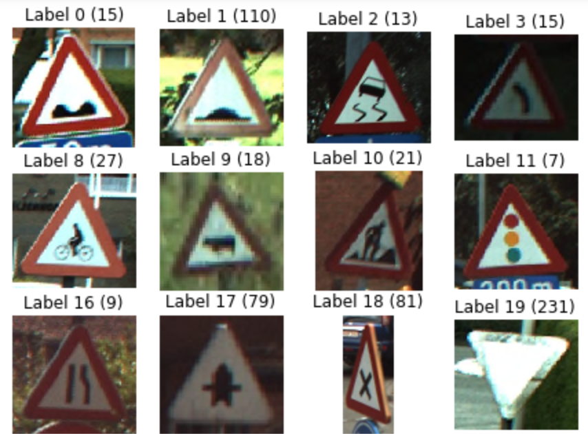

# Classifying Belgian Street Signs To Assist Autonomous Vehicles

A video presentation is avaliable [here](https://www.youtube.com/watch?v=GQL7tAFc2aE).

### Objective 
In the age of autonomous vehicles and snap chat filters, image recognition has played a large role in our society and will continue to do so. Computers are beginning to accomplish what humans can do easily, tell apart a lion and a jaguar, read a sign, or recognize a human form. To do so computers have utilized convolutional neural networks (CNN), which are essentially layers of classifiers, as the primary solution to the image classification problem. CNN’s are highly accurate and produce solid results. However, when faced with uncommon objects or unique objects it can fail.

I used a neural network or convolutional neural network to identify Belgian Street Signs. The goal is to increase accuracy without gathering new data. A strong classifier for Street Signs can augment the performance of an Autonomous vehicle. 

### Data Source
The data I used is available at the link below. I downloaded the images used for Classification which were already split into testing and training sets. This is a popular data set to use for autonomous vehicles because it contains pictures with poor lighting and sub-optimal angles. 

- [BelgiumTs](https://btsd.ethz.ch/shareddata/)

## 
 

### Jupyter Notebooks
My workflow is detailed in the Jupyter Notebooks. Each notebook contains a separate portion of the process. If running the notebooks, I suggest running them in numerical order and using a powerful GPU for the notebooks that contain AWS (Amazon Web Services) in them. I used a machine learning AWS server with GPU computing that cost about 3$/hour.

### Future Improvements?
I would like to improve the performance by adding layers to my CNN, or distorting the images to give my network more training data.
