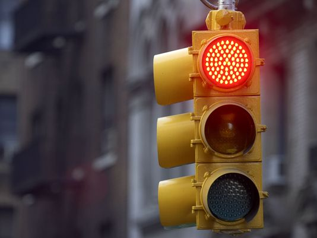

# Classifying Belgian Street Signs To Assist Autonomous Vehicles

A video presentation is avaliable [here](https://www.youtube.com/watch?v=GQL7tAFc2aE).

## 
   

    
### Objective 
In the age of autonomous vehicles and snap chat filters, image recognition has played a large role in our society and will continue to do so. Computers are beginning to accomplish what humans can do easily, tell apart a lion and a jaguar, read a sign, or recognize a human form. To do so computers have utilized convolutional neural networks (CNN), which are essentially layers of classifiers, as the primary solution to the image classification problem. CNN’s are highly accurate and produce solid results. However, when faced with uncommon objects or unique objects it can fail.

I used a neural network or convolutional neural network to identify Belgian Street Signs. The goal is to increase accuracy without gathering new data. A strong classifier for Street Signs can augment the performance of an Autonomous vehicle. 

### Data Sources
I am currently scrapping images from Google images. I would also like to use labeled data from ApolloScape. I may also borrow from the Belgium Traffic dataset which is a popular, self-driving data set. I would like to store these on AWS, or I can use a hard drive. 

- [BelgiumTs](https://btsd.ethz.ch/shareddata/)

- [ApolloScape.auto](http://apolloscape.auto/)

### Potential Problems
I think there will be some initial difficulty with cleaning the data. I cannot use all of it so discerning what to use may be a challenge. Also, I think correctly labeling new images, such as pedestrians, and unusual cars will be highly inaccurate. I may need to find more data to mitigate this issue. 

### Whats Next?
I am downloading images from Google image search. My next step would be to use PyTorch or another Neural Network package on the data to get a minimum viable product. 

## 
 
