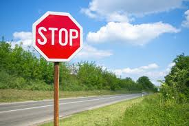

# Classifying Belgian Street Signs

## 
   

    
### Objective 
Use a neural network or convolutional neural network to identify Belgian Street Signs. The goal is to increase accuracy without gathering new data. A strong classifier for Street Signs can augment the performance of an Autonomous vehicle. 

### Background Research
Similar projects have been done before. I stumbled upon one by Waleed Abdulla where he uses Tensor Flow to recognize street signs. Also Dr. Joseph Tansey from a previous cohort created convolutional neural networks that differentiated between images of rocks, paper, and scissors. 

- [Waleed Abdulla Traffic Sign Recognition with TensorFlow](https://medium.com/@waleedka/traffic-sign-recognition-with-tensorflow-629dffc391a6)

- [Joseph Tansey Pitfalls in Image Detection: Solutions that Rock!](https://github.com/joeftansey/Pitfalls-in-Image-Detection-Solutions-that-Rock-)

### Approach/Metric for Successfulness
My approach is to build upon a basic Neural Network structure. Unlike the previous projects I will be attempting to recognize more complex images of pedestrians and cars. I believe I will not be successful in creating a error proof model, but I would measure my success in determining how effective my approach is. 

If I am successful, I would show that this method is viable for autonomous driving. If a car had a snapshot apparatus, those images could then be recognized by a neural network. 

### Presentation
Presentation slides and a Jupyter Notebook detailing the process.
    
### Data Sources
I am currently scrapping images from Google images. I would also like to use labeled data from ApolloScape. I may also borrow from the Belgium Traffic dataset which is a popular, self-driving data set. I would like to store these on AWS, or I can use a hard drive. 

- [BelgiumTs](https://btsd.ethz.ch/shareddata/)

- [ApolloScape.auto](http://apolloscape.auto/)

### Potential Problems
I think there will be some initial difficulty with cleaning the data. I cannot use all of it so discerning what to use may be a challenge. Also, I think correctly labeling new images, such as pedestrians, and unusual cars will be highly inaccurate. I may need to find more data to mitigate this issue. 

### Whats Next?
I am downloading images from Google image search. My next step would be to use PyTorch or another Neural Network package on the data to get a minimum viable product. 

## 
 
